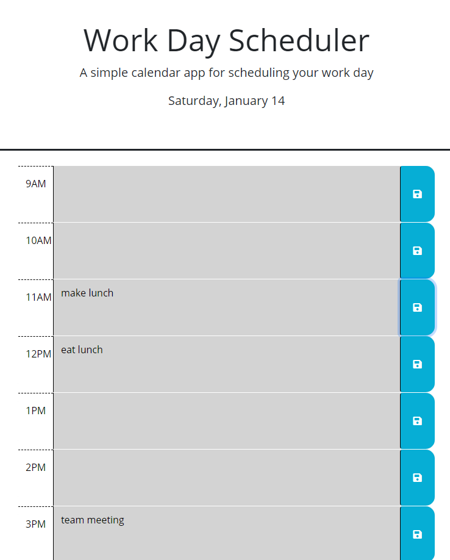

# All In A Day

  ## Table of Contents
  1. [Project Description](#project-description)
  2. [Installation Instructions](#installation-instructions)
  3. [How To Use](#how-to-use)
  4. [How To Contribute](#how-to-contribute)
  5. [Testing](#testing)
  6. [Contact Me](#contact-me)

  ## Project Description
  * This application allows the user to maintain a daily to-do schedule (one day at a time) for a standard 9-5 workday. Enter your tasks in the corresponding workday timeblock and save to store your data. This task will remain saved to the application locally until you replace/erase via subsequent save. Even if you refresh the page!

  ## Installation Instructions
  * This application can be accessed via web browser at https://kabdomora.github.io/AllInADay/

  ## How To Use
  * This app is meant to replace bulky day planners or mail calendars that have too much information!  Use this app to create a to-do schedule just for today!

  ## How To Contribute
  * Contact me on Github to contribute!
  
  ## Testing
  * No tests are currently available

  Deployed Link: https://kabdomora.github.io/AllInADay/
  Deployed screenshot: 

  ## Contact Me
  * Find me on Github: [kabdomora](http://github.com/kabdomora)
  * For additional feedback, email me at [kaylabrown@mednet.ucla.edu](mailto:kaylabrown@mednet.ucla.edu)
